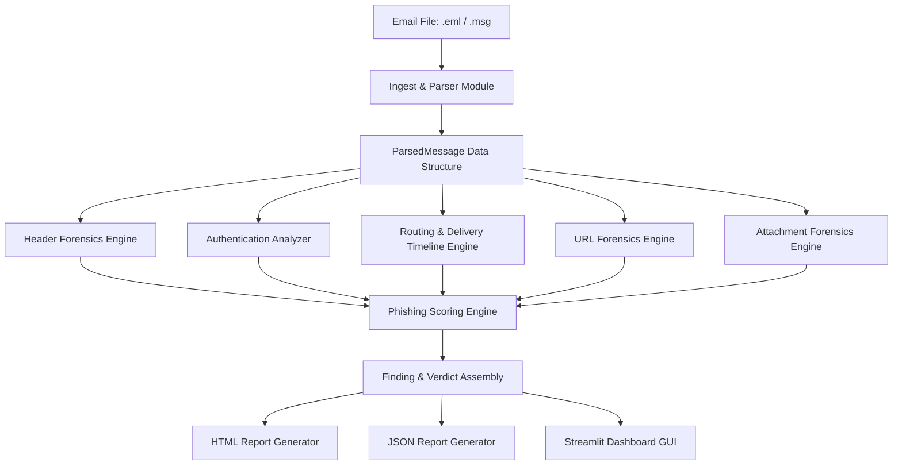
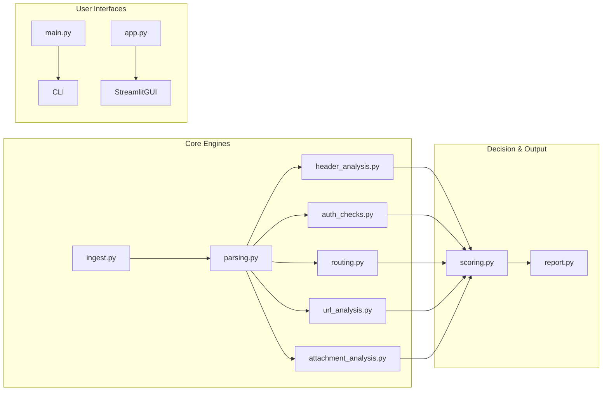

# Email Forensics & Phishing Analyzer 🛡️

A comprehensive, **100% offline**, SOC-ready Email Forensics and Phishing Analysis Platform. Built with Python using clean architecture and SOLID principles, the platform parses `.eml` and Outlook `.msg` files, conducts deep header/routing/authentication forensics, extracts and normalizes URLs, analyzes attachment binary signatures, and outputs executive verdict reports with clear reasoning, evidence logging, and SOC recommendations.

---

## 🌟 Key Features & Capabilities

- **Unified .eml & .msg Parser:** Ingests standard MIME `.eml` messages and Outlook binary `.msg` files using `extract-msg` into a unified internal data model.
- **12-Category Header Forensics:** Detects Display Name spoofing, `From` vs. `Sender` mismatches, `From` vs. `Reply-To` mismatches, `From` vs. `Return-Path` mismatches, missing/duplicate `Message-ID` headers, and non-standard `X-Headers`.
- **Authentication Analysis:** Extracts and evaluates SPF, DKIM, and DMARC results, checks alignment, and flags conflicting `Authentication-Results` headers.
- **Email Delivery Routing Timeline:** Reconstructs the complete MTA relay path from origin to destination, calculates hop-by-hop transit delays, classifies IP addresses (RFC 1918 Private, WAN Public, Loopback), and flags time-travel delays or missing hops.
- **15-Category Weighted Phishing Engine:** Evaluates credential harvesting language, urgent pressure tactics, financial scam indicators, BEC fake invoices, password reset scams, lookalike brand domains (via Levenshtein & homoglyph algorithms), Punycode IDN domains, and high-risk TLDs.
- **Offline URL Forensics Engine:** Extracts all URLs from HTML and plain text, normalizes hostnames, detects raw IP link targets, URL shorteners (`bit.ly`, `tinyurl`), open-redirect query parameters, and deceptive HTML mismatched anchor text links.
- **Offline Attachment Forensics Engine:** Sniffs true binary file signatures, detects executables (`.exe`, `.scr`), scripts (`.vbs`, `.js`, `.ps1`), macro-enabled Office containers (`.docm`, `.xlsm`, OLE containers), double extension masking attacks (`.pdf.exe`), and password-protected archives.
- **Executive Verdict Reports:** Generates executive HTML investigation reports with interactive collapsible sections, color-coded risk badges (`CRITICAL`, `HIGH`, `MEDIUM`, `LOW`), master evidence logs, and actionable SOC recommendations, as well as machine-readable JSON exports.
- **Dual Operating Interfaces:**
  - **Command-Line Interface (CLI):** Batch process email directories via `python src/main.py`.
  - **Streamlit Graphical User Interface (GUI):** Interactive web dashboard via `streamlit run app.py`.

---

## 📐 System Architecture



### Module Diagram



---

## 🚀 Installation Guide

### Prerequisites
- Python 3.10+ installed on Windows, macOS, or Linux.

### Step 1: Clone Repository
```bash
git clone https://github.com/sofiafaisal2004/-Email-Forensics-Phishing-Analyzer.git
cd -Email-Forensics-Phishing-Analyzer
```

### Step 2: Install Dependencies
```bash
pip install -r requirements.txt
```

---

## 💻 Usage Instructions

### 1. Command-Line Interface (CLI)

Batch analyze a directory of `.eml` and `.msg` emails:
```bash
python src/main.py --input tests/fixtures/ --output reports/
```

Analyze a single file:
```bash
python src/main.py --input tests/fixtures/phishing_sample_1.eml --output reports/
```

Output files generated in `reports/`:
- `<filename>.report.html`: Human-readable executive HTML verdict report.
- `<filename>.report.json`: Machine-readable JSON finding structure.
- `summary.json`: Ranked summary of all analyzed emails by phishing score.

### 2. Streamlit Web Dashboard (GUI)

Launch the interactive Streamlit SOC dashboard:
```bash
streamlit run app.py
```

1. Open your browser at `http://localhost:8501`.
2. Drag and drop `.eml` or `.msg` email files into the upload area or select a pre-loaded sample.
3. Explore the 8 interactive forensic tabs and download HTML/JSON investigation reports with one click.

---

## 🔬 University Project Requirements Satisfaction

| Requirement | Implementation Status | Core Module |
| :--- | :--- | :--- |
| **Parse `.eml` & `.msg` Files** | ✅ Fully Implemented | `src/ingest.py`, `src/parsing.py` |
| **Extract Headers, Body & Attachments** | ✅ Fully Implemented | `src/parsing.py`, `src/models.py` |
| **Analyze SPF / DKIM / DMARC** | ✅ Fully Implemented | `src/auth_checks.py` |
| **Analyze Received Headers** | ✅ Fully Implemented | `src/routing.py` |
| **Detect Spoofing & Header Anomalies** | ✅ Fully Implemented | `src/header_analysis.py` |
| **Detect Phishing Threat Indicators** | ✅ Fully Implemented | `src/scoring.py` |
| **Analyze Risky Links & URLs** | ✅ Fully Implemented | `src/url_analysis.py` |
| **Analyze Risky Attachments** | ✅ Fully Implemented | `src/attachment_analysis.py` |
| **Produce Verdict Report with Reasoning** | ✅ Fully Implemented | `src/report.py` |
| **100% Offline Operation** | ✅ Fully Implemented | Zero network dependencies |

---

## 📂 Project Directory Structure

```text
-Email-Forensics-Phishing-Analyzer/
├── app.py                      # Streamlit Web GUI Dashboard
├── README.md                   # Comprehensive System Documentation
├── requirements.txt            # Python dependencies (extract-msg, streamlit, pandas)
├── tests/fixtures/                    # Sample .eml and .msg email files
│   ├── legit_sample_1.eml
│   ├── phishing_sample_1.eml
│   └── phishing_sample_2.eml
├── reports/                    # Generated HTML & JSON reports
│   ├── legit_sample_1.report.html
│   ├── legit_sample_1.report.json
│   ├── phishing_sample_1.report.html
│   ├── phishing_sample_1.report.json
│   ├── phishing_sample_2.report.html
│   ├── phishing_sample_2.report.json
│   └── summary.json
├── src/                        # Core Python Source Code
│   ├── __init__.py
│   ├── ingest.py               # Ingestion engine (.eml and .msg)
│   ├── parsing.py              # Unified MIME parsing engine
│   ├── header_analysis.py      # 12-Category header forensics engine
│   ├── auth_checks.py          # SPF/DKIM/DMARC authentication engine
│   ├── routing.py              # Delivery timeline & routing forensics
│   ├── scoring.py              # 15-Category weighted phishing engine
│   ├── url_analysis.py         # URL extraction & link forensics engine
│   ├── attachment_analysis.py  # Attachment signature & macro forensics
│   ├── report.py               # HTML & JSON report generator
│   ├── models.py               # Data models & dataclasses
│   ├── utils.py                # Shared utility algorithms
│   ├── exceptions.py           # Custom exception classes
│   └── logger.py               # Structured logging setup
└── tests/                      # Unit & Integration Test Suite
    ├── unit/
    │   ├── test_parsing.py
    │   ├── test_header_analysis.py
    │   ├── test_routing_forensics.py
    │   ├── test_scoring.py
    │   ├── test_url_analysis.py
    │   └── test_attachment_analysis.py
    └── integration/
        └── test_pipeline.py
```

---

## 🧪 Test Suite Execution

Run all 28 automated unit and integration tests:

```bash
python -m unittest tests/unit/test_parsing.py tests/unit/test_scoring.py tests/unit/test_header_analysis.py tests/unit/test_routing_forensics.py tests/unit/test_url_analysis.py tests/unit/test_attachment_analysis.py tests/integration/test_pipeline.py
```

---

## 📄 License & Academic Integrity

This project is developed as part of a Digital Forensics & Cybersecurity degree curriculum. All sample emails are synthetically constructed for testing purposes.
